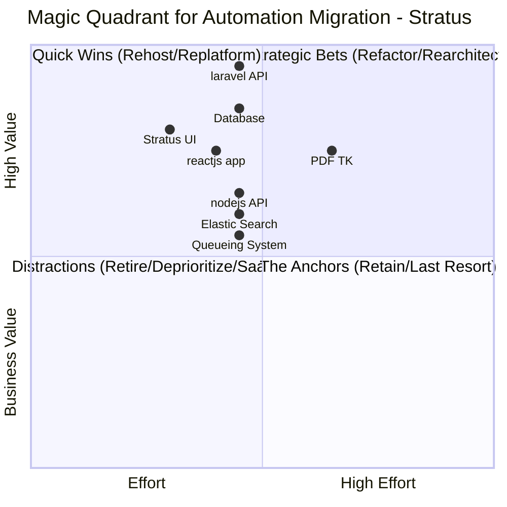

# Roadmapping Exercise

What is the roadmap for the project? What are the key milestones and deliverables? What are the dependencies and constraints?

## Reminder:

### Focus - What is really important

* What is eating a lot of time for a lot of people.
* What is eating a lot of time for people who are unavailable.
* What processes are “causing grief”.
* Implement a process from “End to End” such that you can leave it behind.
* What may be timely due to other changes.
* Who is really responsible/accountable for what application/component/process?
* Do not spend a lot of time focusing on exceptions and “what about-ism”. 
* You will need to create hacks at times to get around constraints.

### Time - Rome was not built in a day.

* Be realistic about how much time process change takes
* Be realistic about how much time culture shift takes
* Be realistic about how much time it will take to learn a new technology(ies).
* Understand that not everything will work the first time.
* Give time to help fix/iterate on the process.
* You will create “hacks” at times for various reasons.  Understand how to find them later to fix them vs lamenting they exist.

### Final Notes
We are not try to solve deep architectural problems for a specific Application. If a discussion goes too long on one item/issue, we will tag it as "Needs Deep Dive" and move to the next item. The goal is the Roadmap, not the Solution Design.

## Alignment & Guardrails (30 Mins) (KurvAgent)

Focus on the "Boundaries":

* Success Metrics: What defines a "win"? (e.g., "Data center empty by Dec 31" vs. "Reduce OpEx by 20%").
    * Primary Goal: Move to AWS and move 100% of our applications to containers and all environments by the end of the year.

* The Hard Constraints: Identify the "unmoveables" immediately (Technology issues, Decision Dependencies, Customer Constraints, or specific regulatory hurdles).
    * Application Pen testing must pass.

* Out of Scope: What is explicitly not part of the project? (e.g., "We are not building a new data center" or "We are not changing our core product offering").
    * Cloudflare - we will continue to use Cloudflare for our CDN and DDoS protection, but we will not be migrating it to AWS Cloudfront.
        * We will use Cloudflare DNS services instead of AWS DNS.
        * We will use Cloudflare's security features instead of AWS WAF.
        * We will use AWS LB services instead of Cloudflare Load Balancing. 
    * Cloud Optimization - out of scope for this project, but we will identify opportunities for it during the migration.
    * PDF TK - we will continue to use PDF TK for our PDF manipulation needs, but we will not be migrating it to AWS Lambda or any other serverless platform.
        * We will use PDF TK on EC2 instances instead of Lambda functions.
        * We will not be refactoring our PDF manipulation processes to be cloud-native, but we will identify opportunities for it during the migration.

## The Migration Matrix: Categorization (90 Mins) (KurvAgent)

This is the core activity. Use a 2x2 grid to plot your applications based on Migration Effort vs. Business Value.

List of items here with more details on each application, including:

* Stratus
    * Current State - Cloud based [linode](https://www.linode.com/)
    * Proposed Migration Strategy - Rehost with Refactor to containers at a general level 
    * Estimated Effort - Low - about 1 month of work to refactor and test everything is working as expected.
    * Business Value - Low/Medium - Company compliance for tech stack, but not a revenue generator.
    * Dependencies - (e.g., "Depends on Database X", "Requires Team Y's involvement")
        * Pythian to review of Dev Environment after configuration is complete for Best Practices/Security/Site Reliability.
        * Probably should take enterprise view of AWS Configuration where applicable even if it is not formalized currently.
        * Network established and VPN connectivity to linode hosting.
        * Read Replica for Database Replication from Source
        * Security would need to review the environment (app pen test) 
    * Risks (e.g., "Data Loss Risk", "Downtime Risk", "Skill Gap Risk")
        * Generally low risk for data loss due to the nature of the application and the fact that we will be using a read replica for database replication from source before cutover.  We will also have a rollback plan in place in case of any issues during cutover.
        * 2 main points of application 'UI' and 'Leads API'.
            * UI - primarily business hours (North America Timezones) risk of something going wrong users can just refresh and this is a current structure/implementation during deployments/issues for a given user.
            * Leads API - primary risk of downtime, however there is a frontend caching/queue that will allow for some downtime to be absorbed without losing data. (Volumes are 1000s per month which would indicate a lead every few minutes, peak times may want to be considered if of major concern).
    * Complexity - 3 different applications (components) - All calls are REST effectively. (e.g., "Simple", "Moderate", "Complex")
    * Application Components worth noting (e.g., "Web Server", "Database", "API Layer")
        1. PDF TK - VM Service for manipulating PDFs for our customers.
            * Proposed Migration Strategy - rehost to EC2 instances with PDF TK installed and configured.
        1. Stratus UI - React application for customers to interact with Stratus.
            * Proposed Migration Strategy - containerize and deploy to AWS ECS Fargate. Will require a pipeline for building and deploying the application to AWS.
        1. laravel API - API (PHP) for Stratus to interact with the database and perform operations for customers.
            * 2 sets of functions 1 for the UI and 1 for the Leads API, both are basically the same, but have different authentication mechanisms.
            * proposed migration strategy - containerize and deploy to AWS ECS Fargate. Will require a pipeline for building and deploying the application to AWS.
        1. Queueing System - Queues via database in mysql currently
            * Proposed Migration Strategy - containerize and deploy to AWS ECS Fargate. Will require a pipeline for building and deploying the application to AWS.
        1. Database - MySQL database for Stratus data storage and retrieval.
            * Proposed Migration Strategy - rehost to AWS RDS MySQL with read replicas for security and performance.  Already has a structure in place for schema management and release related data updates via "commands". 
        1. Elastic Search - Elastic Search for Stratus search functionality.
            * Proposed Migration Strategy - rehost to EC2 instances with Elastic Search installed and configured.  Will require a process to sync data from MySQL to Elastic Search.
        1. nodejs API - digital signature api for customers to sign documents digitally.
            * Proposed Migration Strategy - containerize and deploy to AWS ECS Fargate. Will require a pipeline for building and deploying the application to AWS.  Saves data to S3 bucket and returns a link to the signed document for customers to upload a document temporarily.
        1. reactjs app served via nodejs express service - Public website for lead submission on the internet
            * Proposed Migration Strategy - containerize and deploy to AWS ECS Fargate. Currently has a pipeline for building and deploying on 2 vms. 

## Foundation & Tooling (60 Mins) - KurvMerchant

You can't move apps into a vacuum. Discuss the "Minimum Viable Landing Zone":

### Application Stack & Dependencies

  * KurvMerchant App Stack ASP.NET  - .NET Framework 4.7.2, Windows Server 2012 R2 - 2022, SQL Server 2016 (currently migrating to 2022) 
  * Active Directory is used - currently on-prem external apps/users are being decommed and moved to a different team (KurvMerchant (Chris) and KurvAgent(Anieish)).  Going forward assume all users for this app stack will be "internal", reevaluate if timing of various migrations do not align.

  * SQL Server - 1 large server with multiple databases with cross database joins (8 core, 128GB, < 10TB including all environments).  Currently a project is underway to separate production servers from other environments with a new server (possibly even larger than above).

  * AWS Account Structure: How many accounts do we need? How will we manage them? (e.g., "One account per environment", "Separate accounts for different business units").
    * Account per "Environment" (e.g., "Dev", "Test", "Prod") with appropriate access controls and permissions in place.
    * Separate accounts for different business units or applications if necessary for security or compliance reasons.

  * Active Directory - VPN - and "local node" for authentication and hosting in AWS. Currently no enterprise mandate for an SSO sync like OneLogin or Okta.
  * New apps are being targeted to .NET Core, but no specific plan for Migrating Existing apps from Framework to Core currently exists.  This will likely be primarily a lift and shift to EC2 instances for the .NET Framework apps with some refactoring to containers for certain applications/components where it makes sense.  We will identify opportunities for refactoring to .NET Core and containerization during the migration process, but it is not a primary focus at this time.
  * Storage: Local Storage (mostly PDFs) - will need to be attached to EC2 instances for the lift and shift applications, but we will identify opportunities to move to S3 for better scalability and management during the migration process. 
  * Laserfiche - document management system for storing and retrieving documents.  Out of scope for this project, but we will identify opportunities for it during the migration. (Windows hosted)
  * Many Services which are independent, but are tightly coupled. We will need to identify potential ways to move items as independently as possible, possibly using SQL Server AG grouping features, replication/syncing of PDF documents at the storage level, and other strategies to minimize downtime and risk during cutover.

Identity & Access: Active Directory nodes will be required in cloud for latency and resilience. 

Servers: Would likely recommend EC2 Windows Servers for this lift and shift .NET framework.  Rational for this is due to the fact that there are multiple applications/components that are tightly coupled and would be difficult to separate for containerization without significant refactoring.  Additionally, the use of local attached storage for PDFs and other files is not ideal for containerization, but can be easily accommodated with EC2 instances.  We will identify opportunities for refactoring to .NET Core and containerization during the migration process, but it is not a primary focus of this project.  Specifically:

   * Current Systems are not configured for or using an Load Balancer implementation.
   * Active Directory Integration is required for authentication and authorization.
   * Local storage for PDFs and other files are the primary data storage for a potential group of services.  This will need to be chased apart to understand the dependencies and read/write structures in more detail.

Network Path: Are we using the public internet or a dedicated pipe?
* VPN for security connectivity to on Premise will be required.  
    * Active Directory Sync and connectivity for authentication and authorization.
    * Laserfiche connectivity for a service not currently being migrated.
    * Dynamics (Navision) - probably not migrated as part of this project, but will need connectivity for the foreseeable future.
    * TSYS file transfers - sftp server, potentially could be migrated to AWS Transfer for SFTP, but would require some work to set up and test.  This is also a PCI concern, so we will need to ensure that any solution we implement meets our PCI compliance requirements.

## Roadmap Construction (60 Mins)
Turn the categorized apps into a chronological timeline.

 * Wave 0 (Foundations/Enablers): Identity, Networking, Security.
    * Networking - VPN to on Premise for connectivity to AD, Laserfiche, Dynamics, TSYS file transfers, etc.
    * Identity - Active Directory nodes in AWS for authentication and authorization.
    * AWS - Accounts are already existing for prod and sandbox, other accounts will be made as needed for other environments.  
    * Terraform/Powershell or similar for infrastructure as code and repeatable deployments - to be repeated for each environment to ensure scripts are working as expected.  [AMI](https://docs.aws.amazon.com/AWSEC2/latest/UserGuide/AMIs.html) creation for EC2 instances should be investigated for repeatable deployments and consistency across environments along with configuration management tools like Ansible or AWS SSM for post deployment configuration and management.
    * Pipelines - Local build on Dev Server with publish options for on prem deployment. Currently only 1 pipeline in azure devops, probably should be updated github actions and/or AWS CodePipeline for deployment to AWS.  Will need to be repeated for each environment.
      * [Github Zube](https://github.com/marketplace/zube) integration for tracking work and deployments is used by merchant
      * [monday.com](https://monday.com) is used for work tracking for project tracking sprint planning and linking is used by agent
      * KurvCore is using [Azure DevOps](https://azure.microsoft.com/en-us/products/devops) - probably moving to github over time.
    * [No-PCI](https://www.pcisecuritystandards.org/) for this phase of the project, although this will be required in the future for certain applications and components.  We will need to ensure that any solutions we implement during this phase do not preclude us from achieving PCI compliance in the future.
    * [SQL Server](https://docs.aws.amazon.com/AmazonRDS/latest/UserGuide/USER_SQLServerMultiAZ.html) - RDS SQL Server with AG replication to On-Premises.
        * KurvCore will need to pull apart where database writes are coming from (cross database write actions from another service) some level of synchronous replication in different directions for differnt databases may help minimize downtime and risk during cutover.
* Wave 1 (The Pilot): 2–3 low-criticality apps to test the plumbing.
    * 1 Service hosted on windows server with .NET framework 4.7.2 and only requires PDF files with local attached storage and VPN connectivity/configuration.
        * This service will Test
            * PDF attached storage on EC2 instance
            * Server connected to/syncing with Active Directory in AWS instance
            * Network connectivity to on-premise resources via VPN
            * Application functionality working as expected in the new environment.
        * This service will not test - (another service will be required to test these items in the pilot as well)
            * SQL Server Database connection/instance
            * Active Directory user authentication 
* Wave 2 (The Bulk): The Rehost/Replatform candidates.
   * decide on migration plan for the remaining applications in the Rehost/Replatform quadrants.  This will likely be a mix of lift and shift to EC2 instances and containerization to AWS ECS Fargate.  This may become a big bang cutover if a reasonable subset of application cannot be identified to move independently with minimal downtime and risk. 
 * Wave 3 (The Complex): The Refactor candidates.
   * Decide refactoring plan, but this will focus on.
        * PDF storage - should be moved to a proper storage solution like S3 instead of local attached storage on EC2 instances.
        * Most Services on .NET Framework - Moved to .NET Core and Linux hosting for better performance and cost optimization via containers.
        * Active Directory Authentication - move to Web friendly (i.e. OAuth, SAML) integration for authentication and authorization instead of relying on VPN connectivity to on-prem AD nodes.
 * Wave 4 (The Post Migration): Optimization, Cloud-Native, and any remaining apps.
    * Optimization - identify opportunities for cost optimization, performance improvements, and security enhancements in the new environment.
    * PCI Compliance - move and update for PCI zones and compliance in the new environment.
    * SFTP File Transfers - potentially move to AWS Transfer for SFTP for better integration and management in the cloud.
    * Refactoring PDF storage to S3 for better scalability and management.
    * Other Cloud Items - identify opportunities for refactoring to be more cloud-native and take advantage of cloud services and features.

```mermaid
---
config:
  logLevel: 'debug'
  theme: 'default'
  timeline:
    disableMulticolor: true
---
timeline
    title Roadmap
    section Wave 0 (Foundations)
        Identify    : Active Directory nodes in AWS for authentication and authorization
        Networking  : AWS Network
                    : VPN to on Premise Data Center
        Infrastructure  : AWS Accounts for Environments
                        : Terraform/Powershell for infrastructure as code and repeatable deployments
        Tooling     : Local build on Dev Server with publish options for on prem deployment
                    : Source Control move to Github
    section Wave 1 (The Pilot)
        PDF Router Test : PDF Storage Test
                        : Active Directory Sync and Connectivity Test
                        : Network Connectivity Test
                        : Application Functionality/Environment Test
        App2 TDB        : Active Directory Authentication Test 
                        : SQL Server Database Connectivity Test
    section Wave 2 (The Bulk)
        PDF Storage : replication from source
                    : storage on volumes attached to EC2 instances
        SQL Server AG : replication from source
                      : RDS SQL Server with AG replication to On-Premises
        .NET Services : Configured and Deployed to EC2 instances
        Active Directory : All servers required for application connected to AD in AWS
                         : All Authentication via AD in AWS as needed
    section Wave 3 (The Complex)
        PDF Storage : Move storage to S3
        .NET Framework Services : .NET framework services refactored to .NET Core                     
                                 : Move to Linux hosting in containers
    section Wave 4 (Post Migration)
        Optimization            : Cost optimization
                                : performance improvements
                                : Security enhancements in the new environment.
        PCI Compliance            : Move and update for PCI zones and compliance in the new environment.
        SFTP File Transfers     : Move SFTP to AWS Cloud
                                : Potentially move to AWS Transfer for SFTP for better integration and management in the cloud.
        AD moved to web friendly authentication : Move to Web friendly (i.e. OAuth, SAML) integration for authentication and authorization instead of relying on VPN connectivity to on-prem AD nodes.
        Refactoring to .NET Core and containerization : Final refactoring of remaining .NET Framework services to .NET Core and containerization for better performance and cost optimization via containers.

```

